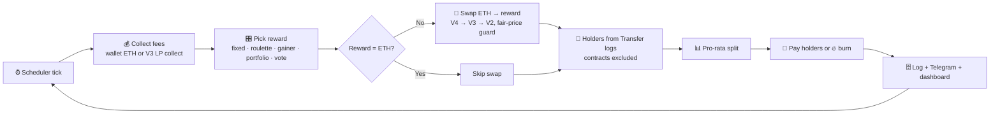

<div align="center">


# 0xdiv

### The dividend policy for memecoins.

**Launchpads on Robinhood Chain pay creators in real stocks. 0xdiv decides what happens next.**
A payout ratio to holders, paid in kind. A share you keep. Buybacks. Retained earnings in a stock treasury with a published book value. A record date that rewards real holders. A yield anyone can compare. Draw the routing on one screen: fees flow to holders, wallets, buybacks and a treasury, each leg with its own share and payout asset. Telegram is the remote; your community watches it happen on a live public dashboard.

[](https://opensource.org/licenses/MIT)
[](https://robinhoodchain.blockscout.com)
[](https://nextjs.org)
[](https://nodejs.org)

</div>

---

## What it does

Robinhood Chain is the first chain where 195 real stocks and ETFs trade as plain ERC-20s (the official Robinhood Stock Tokens), and its launchpads pay creators their fees in those stocks. A memecoin with fees in NVDA is a company with revenue. 0xdiv gives it a dividend policy, every cycle:

1. **💰 Sweeps** the dev wallet: every stock token balance (Multicall3, all 195) and ETH above a gas reserve, plus Uniswap V3 LP fees.
2. **⚖️ Applies the policy**: payout ratio to holders, the share you keep (to your payout address), buyback and burn, retained earnings into a stock treasury.
3. **🎁 Pays in kind**: stock fees go to holders as they are, pro-rata, weighted by loyalty. ETH fees are converted to the stock you chose (best route across Uniswap V4, V3 and V2, fair-price guarded).
4. **♻️ Repeats** on your schedule: every 1 to 60 minutes, or once a day at the closing bell.

Like a boomerang, **the fees always come back.**

---

## ✨ Highlights

- 🤖 **Telegram-native setup**: link a token and start paying dividends in under two minutes.
- 📈 **195 Robinhood Stock Tokens** from Robinhood's own catalog, with a curated liquid pool that fills at fair value today.
- 🎛️ **Reward modes**: Fixed (any stock, ETH, or **any token by contract address**, even another memecoin) · 🎰 Stock Roulette · 🚀 Top Gainer (the day's best stock) · 📊 Portfolio (rotate a basket: Magnificent 7, AI & Semis, Degen Street, Safe Haven) · 🗳️ Community Vote.
- 🔔 **Wall Street schedules**: closing bell (4 pm ET), opening bell, or any interval restricted to market hours.
- 🛡️ **Fair-price guard**: a stock swap only executes if the pool delivers at least 90% of the Yahoo Finance price. Otherwise holders get ETH that cycle and the dashboard says why.
- 🔗 **No third-party holder API**: balances are rebuilt from Transfer logs on chain; pools, routers, the token, the dev wallet and every contract are excluded.
- 💸 **Batched payouts**: one transfer per holder in parallel waves, or one transaction per 150 holders with the optional `0xdivDisperse` contract.
- 🔥 **Buyback and burn** as an alternative destination.
- 🌐 **Live public dashboards** per token, a live ticker tape, a stock universe page, and a public read-only API.
- 🔐 **AES-256-GCM** encrypted dev-wallet keys; decrypted in memory only, at execution time.

---

## 🔄 How the loop works



---

## 💻 Tech stack

| Layer | Stack |
|---|---|
| **Backend** | Node.js · Express · Telegraf · `viem` · `node-cron` |
| **Frontend** | Next.js 16 · React 19 · Tailwind CSS · Recharts · `viem` (signatures) |
| **Data** | Neon (PostgreSQL) |
| **Chain** | Robinhood Chain (4663) · Uniswap V4 / V3 / V2 · Blockscout |
| **Prices** | Yahoo Finance (fair-price oracle, ticker tape) · DexScreener (token metadata) |

---

## 🗂️ Project structure

```
boomerang/
├── backend/
│   └── src/
│       ├── chain/
│       │   ├── config.js       # chain, addresses, clients
│       │   ├── stocks-data.js  # the 195 Stock Tokens (mirrored in frontend/lib)
│       │   └── stocks.js       # registry helpers, liquid pool, baskets
│       ├── services/
│       │   ├── fees.js         # wallet balance / Uniswap V3 collect
│       │   ├── swap.js         # V4 → V3 → V2 router with the fair-price guard
│       │   ├── oracle.js       # Yahoo Finance quotes
│       │   ├── holders.js      # Transfer-log holder ledger (Postgres)
│       │   ├── airdrop.js      # ERC-20 / ETH payouts, Disperse, burn
│       │   ├── rewards.js      # reward modes
│       │   ├── schedule.js     # intervals, bells, market hours
│       │   └── encryption.js   # AES-256-GCM key handling
│       ├── bot/                # Telegram bot (commands, keyboards, flows)
│       ├── scheduler/          # cron + executor (the loop)
│       ├── db/                 # Neon connection, queries, migrations
│       └── api/                # REST endpoints
├── contracts/
│   └── 0xdivDisperse.sol   # optional batch payout contract
└── frontend/
    ├── app/                    # Next.js routes + API (/api/v1/*, dashboards, /stocks, /vote)
    ├── components/             # TickerTape, Hero, StockUniverse, LiveFeed, dashboards…
    └── lib/                    # queries, token metadata, stock registry, wallet hook
```

---

## 🚀 Quick start

> Requires Node 20+, a Neon (or any Postgres) database, and a Robinhood Chain RPC. The public endpoint works; Alchemy or QuickNode give higher limits for the holder indexer.

```bash
# Backend
cd backend
npm install
cp .env.example .env        # DATABASE_URL, RH_RPC_URL, TELEGRAM_BOT_TOKEN, MASTER_ENCRYPTION_KEY
npm run migrate
npm run dev                 # API + Telegram bot + scheduler

# Frontend
cd ../frontend
npm install
cp .env.example .env.local  # DATABASE_URL, NEXT_PUBLIC_BOT_USERNAME
npm run dev                 # http://localhost:3001
```

Generate an encryption key:

```bash
node -e "console.log(require('crypto').randomBytes(32).toString('hex'))"
```

Probe a stock's route before trusting it (read-only, no funds):

```bash
cd backend && node scripts/probe-stock.mjs NVDA 0.01     # one ticker
node scripts/probe-stock.mjs LIQUID 0.01                  # the liquid pool
node scripts/probe-stock.mjs ALL 0.01                     # all 195
```

### Optional: batch payouts

Deploy `contracts/0xdivDisperse.sol` on Robinhood Chain (any Solidity 0.8.20+ toolchain, no constructor arguments) and set `DISPERSE_ADDRESS` in the backend `.env`. Payouts then go out 150 holders per transaction instead of one transfer each.

---

## 🔌 Public API

| Endpoint | Description |
|---|---|
| `GET /api/v1/tokens` | Every token with an active bot: reward, mode, schedule, payouts, sorted by market cap |
| `GET /api/v1/token/<address>` | Is a token linked? Its reward, schedule and stats |
| `GET /api/v1/stocks` | The 195 Robinhood Stock Tokens, with addresses and liquidity flags |
| `GET /api/v1/stats` | Global stats: ETH paid out, dividend cycles, active bots |
| `GET /api/v1/activity` | Recent linked tokens and dividends |

---

## 🔐 Security

- **AES-256-GCM** encryption for every dev-wallet private key; decrypted only in memory, only at execution.
- The bot only collects fees, swaps on Uniswap, and transfers rewards. Nothing else runs against the wallet.
- Parameterized SQL everywhere; secrets live in `.env` (never committed).
- A dev wallet should be **dedicated and disposable**, funded with a little ETH for gas: never your main wallet.

---

## ⚠️ Disclaimer

0xdiv handles real funds and private keys on Robinhood Chain mainnet. Use at your own risk: start small, use a dedicated dev wallet, keep your `MASTER_ENCRYPTION_KEY` safe, and monitor executions. Not affiliated with Robinhood Markets; Stock Tokens are issued by Robinhood, 0xdiv only routes them.

---

## 📝 License

MIT

<div align="center">

**Built for token creators on Robinhood Chain.**
Your fees come back as stocks. 🪃

</div>
